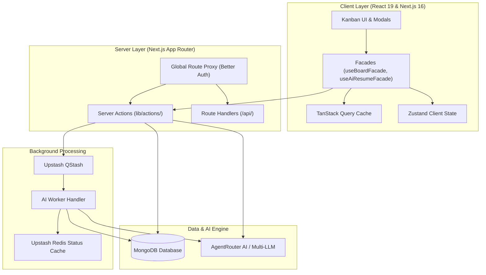

# 🎯 Job Application Tracker & AI Career Intelligence Hub

A production-grade, full-stack job application tracker and career intelligence platform engineered with **Next.js 16 (Turbopack & App Router)**, **React 19**, **TypeScript**, **MongoDB (Mongoose)**, **Better Auth**, and **AgentRouter AI**. 

Manage your job search across a high-performance 60FPS Kanban board, parse PDF resumes, calculate ATS keyword match scores, craft tailored cover letters, and generate formal job application emails in seconds.

---

## 🌟 Key Capabilities & Feature Tour

### 1. 📋 60FPS Kanban Pipeline & Drag-and-Drop
- **100x Order-Spacing Reordering**: Uses a 100x mathematical order multiplier (`order * 100`) to insert cards between existing columns without triggering cascading database re-indexing loops.
- **Physics-Smooth Drag & Drop**: Powered by `@dnd-kit/core` and `@dnd-kit/sortable` with distance-activated pointer sensors to distinguish card clicks from drags.
- **Search & Tag Slicing**: Instant client-side filtering by company, job title, and customizable colored tags with drag-safety protection (target drop positions are computed against raw column order indices to prevent order corruption).
- **TipTap Rich Text Job Descriptions**: Built-in ProseMirror rich-text editor for job descriptions, requirements, and personal interview notes.

### 2. 🧠 AI Intelligence Hub (AgentRouter & Multi-LLM Orchestration)
- **🎯 ATS Resume Matcher**:
  - Compares candidate resume text against the job description.
  - Generates a 0–100% circular match score gauge.
  - Extracts matched keywords vs missing technical keywords.
  - Suggests quantifiable metric improvements and high-impact action verbs.
- **✍️ Tailored Cover Letter Generator**:
  - Crafts personalized, 3-paragraph letters highlighting candidate achievements aligned to stated job requirements.
  - 1-click clipboard copy and instantaneous regeneration.
- **💬 Cold Outreach Message Generator**:
  - Drafts concise, high-converting messages for hiring managers and recruiters on LinkedIn or email.
- **✉️ Job Application Email Generator**:
  - Automatically writes a complete formal application submission draft.
  - Generates a tailored subject line and polished body pitch linking resume achievements to the role description.

### 3. 📄 Smart Resume Library & PDF Parser
- **Multi-Resume Management**: Upload, store, and version multiple candidate resumes (e.g., Frontend, Backend, Full-Stack).
- **Instant Client & Server Text Extraction**: Extracts plain text from uploaded PDF files via `unpdf` for LLM prompt context injection.
- **Job Linking**: Attach specific resume versions to individual job applications or designate a global default resume.

### 4. ⚡ Fair-Usage Quota System & Real-Time Tracking
- **Atomic MongoDB Reservations**: Atomic checks and decrements via `findOneAndUpdate` with rollback guarantees if an external AI request fails.
- **Zero-Limit Preservation**: Supports explicitly configured zero limits (`0`) without fallback resets.
- **Navbar Credit Indicator**: Live visual credit badge in the navbar displaying remaining tries across all 4 AI capabilities (`atsScan`, `coverLetter`, `outreach`, `applicationEmail`).

### 5. 🛡️ Enterprise Admin Console
- **User Management**: View all registered users, application counts, active resumes, and registration timestamps.
- **Live Quota Editor**: Adjust credit counts and limits per feature for any user directly from the admin interface.
- **Custom AI System Prompts**: Admin-configurable system prompts and prompt templates with dynamic variables (`{{jobTitle}}`, `{{company}}`, `{{jobDescription}}`, `{{resumeText}}`).
- **AI Provider Benchmarking**: Configure multiple LLM providers (AgentRouter, OpenAI, Anthropic, Gemini, Groq, or custom endpoints) with real-time latency ping testing.

---

## 🏗️ Architecture & Technology Stack



| Layer | Technologies |
|---|---|
| **Framework** | Next.js 16.2.3 (App Router & Turbopack), React 19.2.4 |
| **Language & Validation** | TypeScript 5 (Strict Mode), Zod v3.25 |
| **Database & ODM** | MongoDB 7, Mongoose 9.4 |
| **Authentication** | Better Auth (Edge Session Cookie Caching & Route Protection Proxy) |
| **Styling & Components** | Tailwind CSS v4, Radix UI Primitives, Lucide Icons, Sonner |
| **State Management** | TanStack React Query v5, Zustand v5 (Facade Architecture) |
| **Drag & Drop** | `@dnd-kit/core`, `@dnd-kit/sortable`, `@dnd-kit/utilities` |
| **Background Jobs & Cache**| Upstash QStash, Upstash Redis |
| **AI Integration** | AgentRouter AI (OpenAI, Anthropic, Groq, Gemini compatible) |
| **Document Processing** | `unpdf` (Server & Client PDF Text Extraction) |

---

## ⚡ Architectural Invariants ("Golden Rules")

When contributing to this repository, the following architectural invariants are strictly enforced:

1. **The Facade-First Rule**: UI components never import TanStack Query hooks, query clients, or mutations directly. All board and AI interactions route through `useBoardFacade` or `useAiResumeFacade`.
2. **Drag-and-Drop Order Safety**: In `kanban-board.tsx`, `columns` (filtered by active search/tags) is used strictly for rendering visual cards, while `rawColumns` (complete, unfiltered) is used strictly for calculating target drop indices in `handleDragEnd`.
3. **Zod String Normalization**: All non-empty string fields use `.string().trim().min(N)`, never `.string().min(N).trim()`.
4. **Form Edit Protection**: Form reset effects during dialog edits never include the server `job` object in dependency arrays, preventing background TanStack Query refetches from wiping unsaved keystrokes.
5. **Atomic Quota & Zero-Limit Integrity**: Quota counters use atomic `findOneAndUpdate` queries and nullish coalescing (`??`) to preserve administrative `0` limits without resetting to default fallback values.
6. **Server Action Contract**: Every Server Action in `lib/actions/` explicitly returns `{ error: string | null, data: T | null }` or `{ error: string | null, success: boolean }`.

---

## 📂 Project Structure

```text
job-application-tracker/
├── app/
│   ├── (admin)/admin/          # Admin Suite (User management, AI prompts, Providers)
│   ├── (auth)/                 # Better Auth routes (sign-in, sign-up)
│   ├── api/                    # Route handlers (auth, ai-status, worker queue)
│   ├── dashboard/              # Protected Kanban Board dashboard
│   ├── globals.css             # Tailwind CSS v4 design tokens
│   ├── layout.tsx              # Root HTML shell & TanStack Query Provider
│   └── page.tsx                # High-converting landing page
├── components/
│   ├── admin/                  # Quota editor, Prompt manager, Provider cards
│   ├── ai/                     # ATS Analysis Modal, Credit Indicator, Resume Dialog
│   ├── ui/                     # Accessible Radix / Shadcn UI components
│   ├── kanban-board.tsx        # Drag-and-drop board coordinator
│   ├── job-application-card.tsx# Interactive sortable job card
│   └── navbar.tsx              # Dynamic session navbar with credit tracker
├── docs/                       # Modular technical documentation
│   ├── architecture.md         # Data flow and system architecture
│   ├── authentication.md       # Better Auth edge caching and proxying
│   ├── database-and-models.md  # MongoDB schemas and 100x reordering algorithm
│   ├── development-and-testing.md # Pre-flight checks and testing rules
│   ├── forms-and-validation.md # Zod validation and React Hook Form patterns
│   ├── state-management.md     # Facade pattern and optimistic updates
│   └── ui-and-components.md    # Dnd-kit sensors and UI token guidelines
├── lib/
│   ├── actions/                # Server Actions (board, jobs, resumes, AI, admin)
│   ├── ai/                     # AgentRouter LLM processor & default prompts
│   ├── auth/                   # Better Auth configuration & client hooks
│   ├── facades/                # Decoupled state facades (useBoardFacade, useAiResumeFacade)
│   ├── models/                 # Mongoose schemas (Board, Column, Job, Resume, UserUsage)
│   ├── queries/                # TanStack Query hooks & mutations
│   ├── upstash/                # QStash background publisher & Redis status client
│   └── validations/            # Zod validation schemas
├── scripts/
│   └── seed.ts                 # Database seeding script for local development
├── AGENTS.md                   # Agent guidelines and architectural invariants
└── README.md                   # Project documentation
```

---

## 🚀 Getting Started Locally

### 1. Prerequisites
- **Node.js**: `v20.x` or higher
- **MongoDB**: Local instance or MongoDB Atlas connection string
- **NPM** / **PNPM** / **Bun**

### 2. Clone and Install
```bash
git clone https://github.com/Tahsin005/job-application-tracker.git
cd job-application-tracker
npm install
```

### 3. Configure Environment Variables
Copy `.env.example` to `.env`:
```bash
cp .env.example .env
```
Fill in the necessary secrets:
```env
# Better Auth
BETTER_AUTH_SECRET=your_super_secret_session_key
BETTER_AUTH_URL=http://localhost:3000

# Database
MONGODB_URI=mongodb://localhost:27017/job-application-tracker

# AgentRouter AI (or OpenAI / Anthropic)
AGENTROUTER_API_KEY=your_agentrouter_api_key
AGENTROUTER_BASE_URL=https://agentrouter.org/v1
AGENTROUTER_MODEL=glm-5.3

# Upstash Redis (Optional for background polling)
UPSTASH_REDIS_REST_URL=your_redis_rest_url
UPSTASH_REDIS_REST_TOKEN=your_redis_token

# Upstash QStash (Optional for background queues)
QSTASH_TOKEN=your_qstash_token
QSTASH_CURRENT_SIGNING_KEY=your_qstash_current_signing_key
QSTASH_NEXT_SIGNING_KEY=your_qstash_next_signing_key
```
*(Note: If Upstash QStash is not configured or in local development mode, the platform automatically executes AI operations in direct execution mode.)*

### 4. (Optional) Seed Sample Job Applications
```bash
npm run seed:jobs
```

### 5. Launch Development Server
```bash
npm run dev
```
Open [http://localhost:3000](http://localhost:3000) in your browser!

---

## 🧪 Pre-Flight Verification & Quality Control

Before committing or submitting a pull request, ensure all three quality gates pass with zero errors:

```bash
# 1. Verify ESLint compliance
npm run lint

# 2. Verify TypeScript strict types
npx tsc --noEmit

# 3. Verify Next.js production build compilation
npm run build
```

---

## 📄 License

This project is licensed under the MIT License. Contributions and feedback are welcome!
